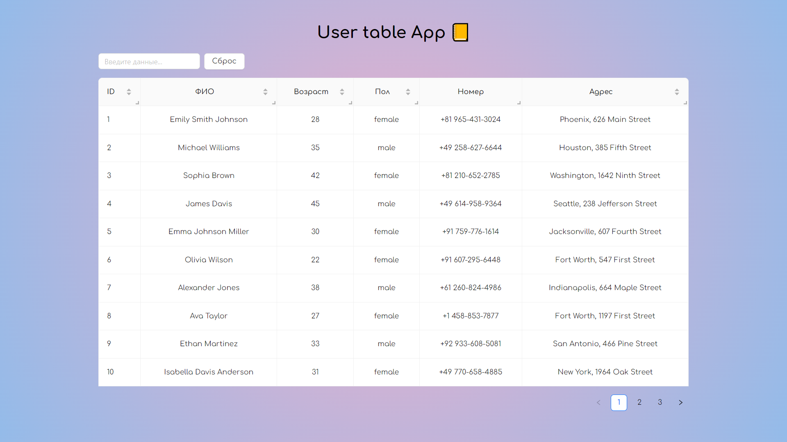
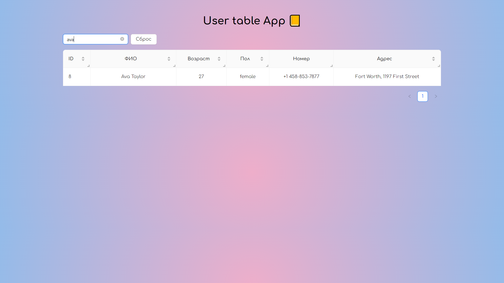
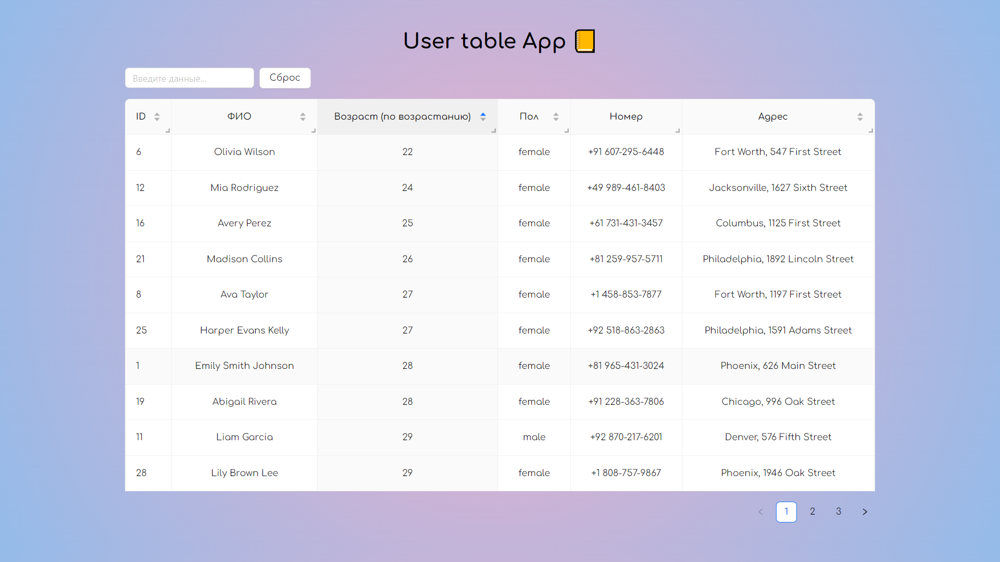
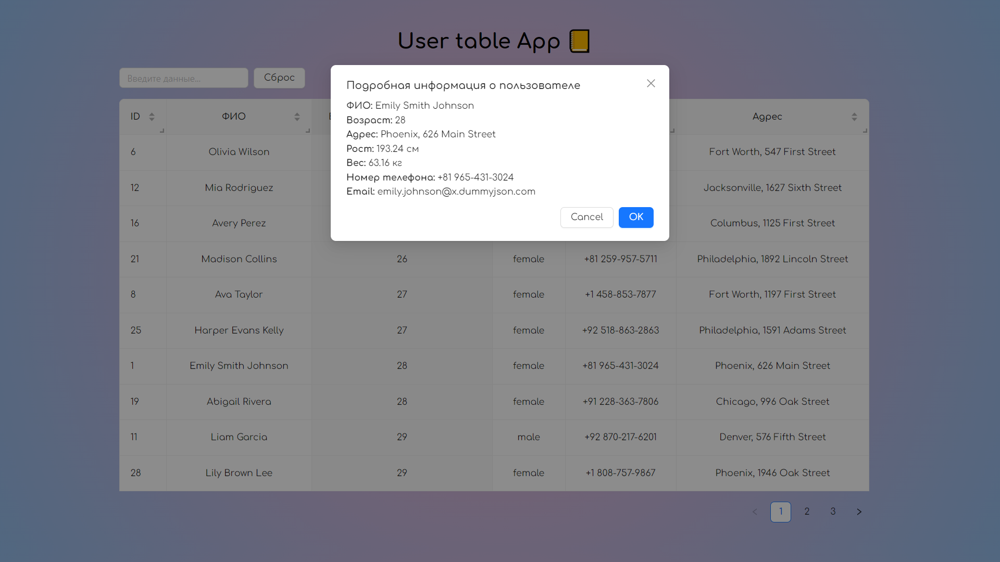

# Таблица с пользователями

Тестовое задание для &nbsp; 

## Стек

## Задание:

Задание: Необходимо разработать приложение, которое отображает таблицу с информацией о
пользователях, с возможностью поиска по всей таблице. В таблице должны быть следующие
колонки: ФИО, возраст, пол, номер телефона и адрес (город и название улицы).

## Основные цели:

-  Описание, используемых в задании, HTTP-запросов можно найти на ресурсе
https://dummyjson.com/docs/users;
-  Реализуйте указанную в задании таблицу при помощи запроса https://dummyjson.com/users;
- Добавьте input-компонент поиска информации из колонок по всей таблице с помощью запроса
https://dummyjson.com/users/filter;

- Ширина таблицы – 100% от экрана пользователя, но не более 1200px;
- Для работы с HTTP-запросами допустимо использовать только FetchAPI.

## Дополнительные цели:

- Добавьте возможность сортировки элементов таблицы для колонок с ФИО, возрастом, полом
и адресом. Сортировка должна иметь три состояния: по возрастанию, по убыванию, без
сортировки;

- Добавьте возможность изменения ширины каждой колонки таблицы. Минимальная ширина
столбца при такой возможность должна быть равна 50px. Для значений, не умещающихся по
ширине, добавьте отображение “…” в конце поля;
- Реализуйте обработку возможных ошибок при работе с HTTP-запросами;
- Добавьте отображение модального окна с подробной информацией о пользователе по клику
на строку таблицы. В окне выведите следующую информацию: ФИО, возраст, адрес (город и
название улицы), рост, вес, номер телефона и email-адрес.

## Деплой

Разместить задание на GitHub pages не получилось, поэтому разместил на Vercel:
https://react-users-table-omega.vercel.app/

## Скриншоты

---

---

---

